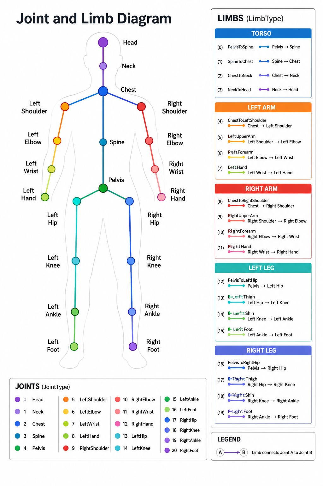

# ClimbUp
This is a mobile application made for climbers who want an easier time visualizing and planning out their beta.
The main features will include:
- A manipulatable figure based on the user's physical characteristics that can be used to test out positions or test reach
- A center of gravity calculation and visualization to understand how different positions might feel or which ones might be more stable
- Users can group and store positions they create for a particular climb 

## Other features will include:
- "Flattening" angled walls (angle will be determined either by computer vision or by user input) so that calculations on non vertical walls will remain as accurate as possible
- A friends system where user's can share their beta for their particular physical characteristics so people can search for beta that would work better for them

## Future possible feature may include:
- Letting users indicate how good a particular hold might be and then estimating how realistic/good a certain position is
- A way to account for multi-angled walls (i.e., 45 degree overhang into a vertical wall)
- Automatic beta generations or beta completion by interpreting the wall and holds as a graph and using the idea of hold quality, center of gravity, and the user's physical characteristics
- Daily climb that people can treat as a puzzle...
- If people choose to let their beta be public, we can have a  system where the coordinates of holds 
(and angle of the wall) can be saved into the DB have their beta assigned as a value. Whenever a user uploads
a climb that they want to use, we can compare the characteristics of the route with the ones in the DB and see
if there are any Similar routes that have beta for them. If yes, then we can display a button that gives the user
an option to view these.

# What inspired this idea:
Fatigue is a huge limitation to whether or not you send a climb. Especially for projecting, the most efficient way to progress on a climb while minimizing fatigue is by practicing and try specific moves/sections of a climb. But what if you just want to see if you can reach a particular hold? Or what if you just want to see how you could position your body to get a better position under a sloper? Or what if you're like me and you don't want to go up, do the crux of the climb, just for it to not count since you skipped the super easy start of a climb... These are just a Few of the issues that inspired the idea of ClimbUp. I believe that the convenience of being able to get an idea of how different positions might feel, or even just storing beta that already works for you so that you don't forget, is something that can be helpful to many.

## Skeleton Structure

